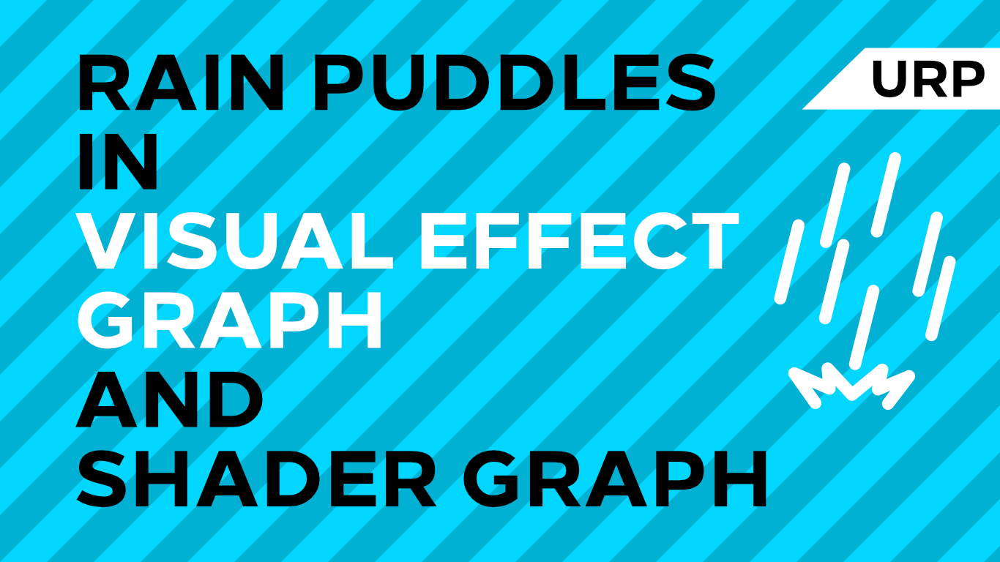

# Rain Puddles in Unity URP

A rain puddle effect using Unity Shader Graph, Visual Effect Graph and Universal Render Pipeline.

## Overview

This project contains a rain puddle shader which uses an animated raindrop texture and a 'puddle map' to determine which sections of the floor are covered in rainy puddles. On top of that, a particle effect is used to simulate falling raindrops.

## Software

This project was created using Unity 2019.3.0f6 and Universal Render Pipeline 7.1.8.

## Authors

This project and the corresponding tutorial series were written by Daniel Ilett. [Follow him on Twitter](https://twitter.com/daniel_ilett) for more gamedev tutorials!

## Release

This project was released on May 18th 2020. 
